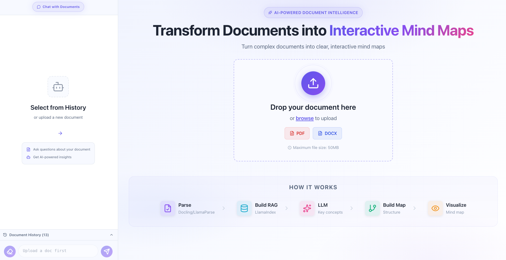
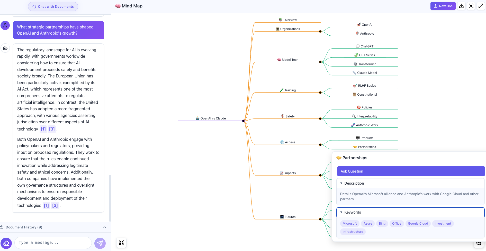

# 🧠 AI-Powered Document to Mindmap





Transform your documents into interactive mindmaps with AI-powered analysis and chat capabilities. Upload PDFs, generate structured mindmaps, and interact with your content through an intelligent RAG-based chat interface.

   

## ✨ Features

- **📄 Document Parsing**: Upload and parse PDF documents using LlamaParse or Docling
- **🗺️ Interactive Mindmaps**: Automatically generate visual mindmaps from document structure
- **💬 AI Chat Interface**: Chat with your documents using RAG (Retrieval-Augmented Generation)
- **🎨 Modern UI**: Clean, responsive interface built with React and TypeScript
- **📚 Document History**: Track and revisit all your processed documents
- **🔍 Smart Search**: Query-based document exploration with context-aware responses

## 🏗️ Architecture

### Frontend (React + TypeScript + Vite)
- React 19.2 with TypeScript
- Markmap for mindmap visualization
- Context-based state management
- Responsive design with modern UI components

### Backend (Python + FastAPI)
- **FastAPI Server**: REST API for document processing and chat
- **Document Parsers**: LlamaParse & Docling support
- **LLM Integration**: OpenAI GPT for intelligent transformations
- **RAG Pipeline**: LlamaIndex + ChromaDB for semantic search
- **Vector Storage**: Persistent embeddings and document indexing
- **Local Storage**: Currently uses file-based storage in `local_storage/` folder (can be migrated to database as needed)

## 🚀 Quick Start

### Prerequisites

- **Node.js** 16+ and npm
- **Python** 3.9+
- **OpenAI API Key** (set in `.env` file)

### Easy Setup (All Platforms)

#### macOS / Linux
```bash
chmod +x setup-and-run.sh
./setup-and-run.sh
```

#### Windows
```cmd
setup-and-run.bat
```

This will:
1. Install frontend dependencies
2. Build the frontend
3. Install Python backend dependencies
4. Start the FastAPI server

The application will be available at `http://localhost:8000`

### Manual Setup

#### 1. Frontend Setup
```bash
# Install dependencies
npm install

# Build the frontend
npm run build
```

#### 2. Backend Setup
```bash
# Navigate to backend directory
cd backend

# Create virtual environment (optional but recommended)
python -m venv venv

# Activate virtual environment
# On macOS/Linux:
source venv/bin/activate
# On Windows:
venv\Scripts\activate

# Install dependencies
pip install -r requirements.txt

# Create .env file with your OpenAI API key
echo "OPENAI_API_KEY=your_api_key_here" > .env
```

#### 3. Run the Application
```bash
# From the backend directory
python main.py
```

Visit `http://localhost:8000` in your browser.

## 📁 Project Structure

```
mindmap/
├── frontend/
│   ├── src/
│   │   ├── components/      # React components
│   │   │   ├── LandingPanel.tsx    # Upload interface
│   │   │   ├── MarkmapPanel.tsx    # Mindmap viewer
│   │   │   └── ChatPanel.tsx       # RAG chat interface
│   │   ├── contexts/        # React context providers
│   │   └── App.tsx          # Main application
│   ├── package.json
│   └── vite.config.ts
│
├── backend/
│   ├── main.py              # FastAPI server (entry point)
│   ├── pipeline_cli.py      # CLI tool for document processing
│   ├── pipeline.py          # Document processing pipeline
│   ├── requirements.txt     # Python dependencies
│   │
│   ├── parser/              # Document parsing
│   │   └── parser.py        # LlamaParse & Docling integration
│   │
│   ├── llm/                 # LLM transformations
│   │   ├── llm_transform.py # Mindmap generation logic
│   │   ├── prompts.py       # LLM prompt templates
│   │   └── fallback_llm.py  # Fallback strategies
│   │
│   ├── RAG/                 # Retrieval-Augmented Generation
│   │   └── rag_pipeline.py  # RAG implementation with LlamaIndex
│   │
│   └── local_storage/       # Processed documents & embeddings
│
├── setup-and-run.sh         # macOS/Linux setup script
├── setup-and-run.bat        # Windows setup script
└── README.md
```

## 🔧 Configuration

### Environment Variables

Create a `.env` file in the `backend/` directory:

```env
# Required
OPENAI_API_KEY=your_openai_api_key_here

# Optional - Parser Selection
USE_LLAMAPARSE=FALSE  # Set to TRUE to use LlamaParse, FALSE for Docling

# Optional - LlamaParse (if using)
LLAMA_CLOUD_API_KEY=your_llama_cloud_api_key

# Optional - File paths
DATA_FOLDER=data
OUTPUT_MD=output/output.md
OUTPUT_TOC=toc_tree.json
OUTPUT_MINDMAP=mindmap_transformed.json

# Optional - LLM Model Configuration (Adjust based on your needs)
OPENAI_MODEL=gpt-4  # or gpt-3.5-turbo, gpt-4-turbo
CHUNK_SIZE=2048     # Adjust chunk size if context exceeds token limits
```

### Parser Options

The application supports two document parsing engines:

1. **Docling** (Default): Free, local parsing
2. **LlamaParse**: Cloud-based parsing with higher accuracy (requires API key)

Set `USE_LLAMAPARSE=TRUE` in `.env` to switch to LlamaParse.

### ⚙️ Advanced Configuration

#### Model Selection & TPM Limits

When working with large documents, you may need to adjust the LLM model based on:
- **Context size**: Large documents with many parent/child nodes can exceed token limits
- **TPM (Tokens Per Minute) limits**: Your OpenAI API tier determines throughput
- **Cost considerations**: Balance between model capability and cost


#### Chunk Size Configuration

If you encounter context length errors, adjust the `CHUNK_SIZE` environment variable:

```env
# Default - works for most documents
CHUNK_SIZE=2048

# For very large documents - split into smaller chunks
CHUNK_SIZE=1024

# For documents with simple structure - use larger chunks
CHUNK_SIZE=4096
```

The chunk size determines how document content is split during RAG indexing. Smaller chunks provide more precise retrieval but may lose context; larger chunks preserve context but may be less precise.

#### Prompt Customization

Customize the mindmap visualization style by modifying prompts in `backend/llm/prompts.py`:

- **Tree structure style**: Adjust how parent/child relationships are represented
- **Node naming conventions**: Customize how nodes are labeled and described
- **Depth and branching**: Control the hierarchy depth and number of branches
- **Content summarization**: Tune how document sections are summarized in nodes

**Example customization:**
```python
# In backend/llm/prompts.py
# Modify the system prompt to match your preferred visualization style
# - Hierarchical vs. network-based structure
# - Concise labels vs. detailed descriptions
# - Technical focus vs. high-level overview
```

### 💾 Storage Configuration

**Current Implementation:**
The application currently uses a **file-based local storage system** located in `backend/local_storage/`. Each processed document gets its own folder containing:
- Extracted text and metadata
- Generated mindmap JSON
- RAG embeddings (ChromaDB)
- Vector indices

**Future Migration:**
For production deployments or higher scalability needs, the local storage can be migrated to a proper database solution:
- **PostgreSQL** for document metadata and content
- **Vector databases** (Pinecone, Weaviate, Qdrant) for embeddings
- **Cloud storage** (S3, GCS) for document files

The current file-based approach works well for development and small-to-medium deployments, with easy migration path available when needed.

## 🎯 Usage

### 1. Upload a Document
- Click "Upload Document" on the landing page
- Select a PDF file
- Wait for processing (parsing + mindmap generation)

### 2. Explore the Mindmap
- Interactive zoomable mindmap visualization
- Click nodes to expand/collapse
- Pan and zoom to navigate

### 3. Chat with Your Document
- Use the chat panel to ask questions
- Get context-aware responses powered by RAG
- Responses include relevant document excerpts

### 4. View History
- Access previously processed documents
- Switch between different documents
- Each document maintains its own chat history

## 🛠️ API Endpoints

### Document Processing
- `POST /process_pdf` - Upload and process a PDF document
- `GET /history` - Get list of processed documents
- `GET /document/{doc_id}` - Load a specific document

### Chat Interface
- `POST /chat` - Send a message and get AI response
- `POST /reset_chat/{doc_id}` - Clear chat history for a document

## 🧪 Development

### Frontend Development
```bash
npm run dev  # Start Vite dev server
npm run build  # Build for production
npm run lint  # Run ESLint
```

### Backend Development
```bash
# Run with auto-reload
uvicorn main:app --reload

# Run CLI tool for testing
python pipeline_cli.py --transform --toc-file input.json
```

## 📦 Key Dependencies

### Frontend
- React 19.2
- TypeScript
- Vite
- markmap-lib & markmap-view
- Lucide React (icons)

### Backend
- FastAPI
- OpenAI Python SDK
- LlamaIndex (RAG)
- ChromaDB (vector storage)
- LlamaParse / Docling (parsers)
- python-dotenv

## 🤝 Contributing

Contributions are welcome! Please feel free to submit a Pull Request.

## 📄 License

MIT License - feel free to use this project for personal or commercial purposes.

## 🙏 Acknowledgments

- [LlamaIndex](https://www.llamaindex.ai/) for RAG capabilities
- [Markmap](https://markmap.js.org/) for mindmap visualization
- [LlamaParse](https://docs.cloud.llamaindex.ai/) & [Docling](https://github.com/DS4SD/docling) for document parsing
- OpenAI for GPT models

## 📧 Contact

For questions or feedback, please open an issue on GitHub.

---

**Built with ❤️ using AI and modern web technologies**
